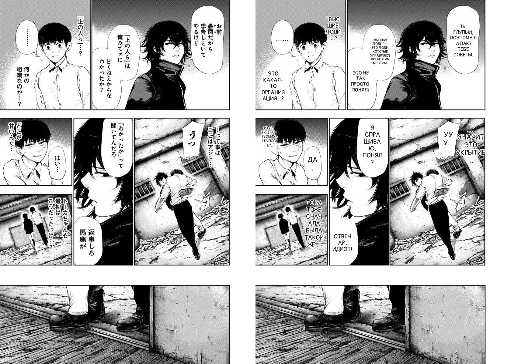
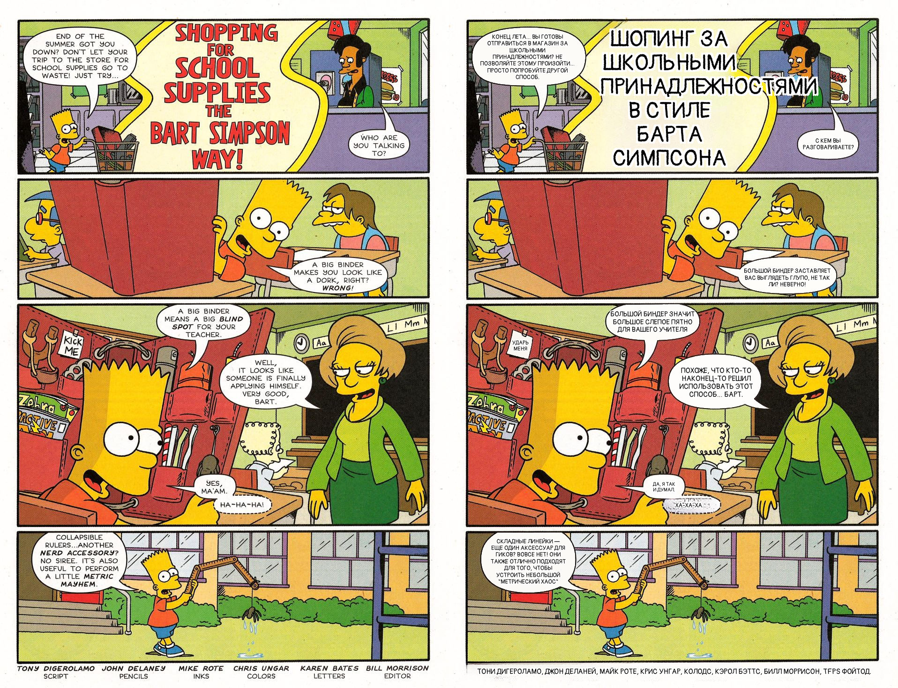

# Manga Translator

A neural pipeline and desktop editor that translates manga and comics: open a
folder of pages and get them back with the dialogue translated, the original
text erased, the background reconstructed, and the translation re-lettered
straight into the speech bubbles.

## Examples

Original on the left, the app's output on the right.

**Japanese manga → Russian**



**English comic → Russian**



## Features

The tool detects text and speech bubbles on every page, reads the original
text, translates it, and renders the result back onto the page. It runs as a
desktop editor and as a headless command-line batch job over a whole chapter.

- **Automatic translation.** Each page is run through detection, OCR, and
  translation on its own. The whole page is translated as a single ordered
  batch (in proper reading order — right-to-left for manga, left-to-right for
  Western comics), so the model sees the context between bubbles instead of
  translating each fragment in isolation.
- **Per-page or batch.** In the editor you translate and review one page at a
  time; from the command line you translate an entire folder in one run.
- **Manual editing.** Every fragment is an editable box on the page: fix the
  translation text, toggle a fragment on or off, change font family, size and
  casing, move or resize the box, or draw a new box by hand (it gets OCR'd and
  translated automatically). Original text and edits are preserved as you flip
  between pages.
- **Automatic inpainting on export.** When you export, the original text is
  erased automatically — bubble interiors are repainted with the bubble's own
  tone right up to the outline, while text over artwork (and any tricky bubble)
  is removed with LaMa inpainting. The translation is then drawn in a bundled
  comic font, centered, with a white outline for legibility.

## Supported languages

- **Source (OCR):** Japanese, English, Chinese, Korean, Spanish, French,
  German, Portuguese, Italian, Russian. Japanese is read with Manga OCR;
  every other language with EasyOCR.
- **Target (translation):** Russian, English, Chinese, Korean, Spanish, French,
  German, Portuguese, Italian, Turkish.

## Installation

Python 3.11. Dependency versions conflict if resolved in a single pass, so
install in two steps:

```bash
pip install -r requirements.txt
pip install --no-deps simple-lama-inpainting==0.1.2
```

The detection and translation checkpoints are not included in the repository —
place them in `manga_ui/models/`:

- `checkpoint_best_ema.pth` — fine-tuned RF-DETR detection weights;
- `HY-MT1.5-1.8B-Q4_K_M.gguf` — quantized translation model.

Manga OCR, EasyOCR and LaMa weights are downloaded automatically on first use.
Everything runs on CPU; a GPU is used automatically when available.

## Usage

### GUI

```bash
python3 main.py
```

Open a folder of page images, flip through the pages (detection and translation
run in the background), edit fragments as needed, then export a page or the
whole folder.

### Command line (batch)

Translate a whole folder without the GUI:

```bash
python3 main.py --batch input_dir output_dir --source-lang Japanese --target-lang Russian
```

`--source-lang` and `--target-lang` accept any of the languages listed above.

## How it works

Each page goes through the full pipeline:

1. **Detection** — a fine-tuned RF-DETR Medium locates text blocks and speech
   bubbles.
2. **OCR** — Manga OCR for Japanese, EasyOCR for the other languages.
3. **Translation** — HY-MT1.5 (Tencent Hunyuan-MT) via llama.cpp, one ordered
   batch per page, with a per-fragment fallback if the batch response can't be
   parsed.
4. **Text removal** — bubble-tone fill inside bubbles, LaMa inpainting outside.
5. **Rendering** — the translation is fit into the box in the bundled Pangolin
   comic font, centered, with a white outline.

## Models & acknowledgements

This project builds on the following open models and libraries:

- [RF-DETR](https://github.com/roboflow/rf-detr) — Roboflow, real-time
  detection transformer (Apache-2.0), fine-tuned here for bubble/text detection.
- [Manga OCR](https://github.com/kha-white/manga-ocr) — kha-white, Japanese
  manga text recognition.
- [EasyOCR](https://github.com/JaidedAI/EasyOCR) — JaidedAI, multilingual OCR.
- [HY-MT1.5-1.8B](https://huggingface.co/tencent/HY-MT1.5-1.8B)
  ([Hunyuan-MT](https://github.com/Tencent-Hunyuan/HY-MT)) — Tencent, the
  translation model, run through
  [llama-cpp-python](https://github.com/abetlen/llama-cpp-python).
- [LaMa](https://github.com/advimman/lama) — resolution-robust inpainting, via
  [simple-lama-inpainting](https://github.com/enesmsahin/simple-lama-inpainting).
- [Pangolin](https://fonts.google.com/specimen/Pangolin) — bundled comic
  lettering font (SIL Open Font License 1.1).

## License

Apache-2.0. See [LICENSE](LICENSE). Bundled font and third-party models are
covered by their own licenses (see above).
